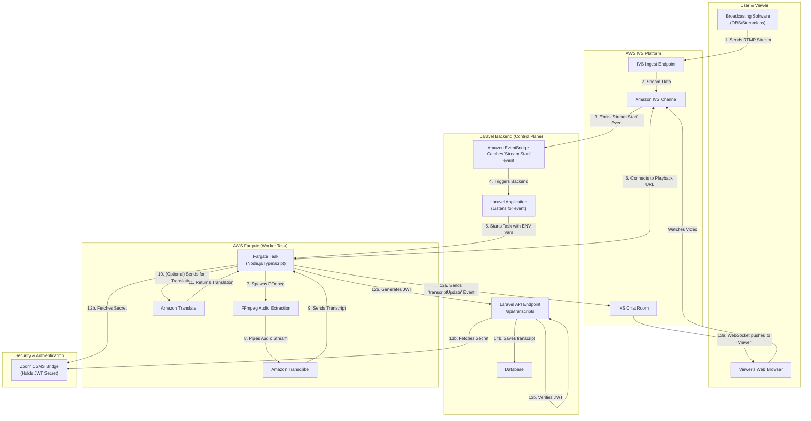

# RTMPS Transcription Architecture

```mermaid
graph TD
    subgraph "User & Viewer"
        A["Broadcasting Software <br> (OBS/Streamlabs)"]
        B["Viewer's Web Browser"]
    end

    subgraph "AWS IVS Platform"
        C["IVS Ingest Endpoint"]
        D["Amazon IVS Channel"]
        E["IVS Chat Room"]
    end

    subgraph "Laravel Backend (Control Plane)"
        F["Amazon EventBridge <br> Catches 'Stream Start' event"]
        G["Laravel Application <br> (Listens for event)"]
        H["Database"]
        I["Laravel API Endpoint <br> /api/transcripts"]
    end

    subgraph "AWS Fargate (Worker Task)"
        J["Fargate Task <br> (Node.js/TypeScript)"]
        K["FFmpeg Audio Extraction"]
        L["Amazon Transcribe"]
        M["Amazon Translate"]
    end

    subgraph "Security & Authentication"
        N["Zoom CSMS Bridge <br> (Holds JWT Secret)"]
    end

    %% --- The Flow ---

    A -- "1. Sends RTMP Stream" --> C
    C -- "2. Stream Data" --> D
    D -- "3. Emits 'Stream Start' Event" --> F
    F -- "4. Triggers Backend" --> G
    G -- "5. Starts Task with ENV Vars" --> J

    J -- "6. Connects to Playback URL" --> D
    J -- "7. Spawns FFmpeg" --> K
    K -- "8. Pipes Audio Stream" --> L
    L -- "9. Sends Transcript" --> J
    J -- "10. (Optional) Sends for Translation" --> M
    M -- "11. Returns Translation" --> J

    J -- "12a. Sends 'transcriptUpdate' Event" --> E
    E -- "13a. WebSocket pushes to Viewer" --> B

    J -- "12b. Fetches Secret" --> N
    J -- "12b. Generates JWT" --> I
    I -- "13b. Fetches Secret" --> N
    I -- "13b. Verifies JWT" --> I
    I -- "14b. Saves transcript" --> H

    B -- "Watches Video" --> D
```
